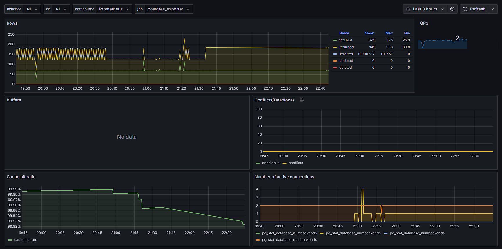

# 💼 Job Scope – Clean Architecture FastAPI Example

## Introduction

The main goal of this project is to provide a high-quality template demonstrating best practices in software 
development, including **SOLID principles**, **Clean Architecture**, **modularity**, **clearly defined boundaries**, 
and **explicit naming conventions**.

Unlike typical Clean Architecture examples found online, which often only illustrate basic CRUD operations within a 
single module, this project aims to showcase **realistic interactions** and **production-grade complexity**.

This project serves as a reference and educational example rather than a plug-and-play template.

---
## ✨ Features

- ✅ Clean Architecture & SOLID principles  
- 🔐 JWT (ES256) authentication supporting cookie and header transports
  → **Tokens (access & refresh) are stored and can be revoked**
- 🧠 User + Anonymous session injection via middleware 
- 🧱 Built-in CRUD generator: DB models and routers (outside Clean Architecture scope)
- 🧾 Centralized logging (Filebeat → Logstash → Elastic → Kibana)  
- 📬 Telegram alerts for `ERROR` logs  
- 📊 Prometheus & Grafana monitoring (FastAPI, DB, system, nginx)  
- 🔎 ElasticSearch-powered vacancy search  
- 🔁 Celery-based background and periodic task processing  
- 🧪 Modular test layers: unit, functional, integration  
- 🐳 Full Docker support with development and test environments  

---
## 🧰 Tech Stack

| Category             | Technologies                                               |
|----------------------|------------------------------------------------------------|
| **Language**         | Python 3.13                                                |
| **Web Framework**    | FastAPI                                                    |
| **Task Queue**       | Celery + Redis                                             |
| **Authentication**   | JWT (ES256), Cookies & Headers, Redis-backed token storage |
| **Database**         | PostgreSQL + SQLAlchemy                                    |
| **Search Engine**    | Elasticsearch                                              |
| **Infrastructure**   | Docker, Docker Compose                                     |
| **Logging**          | Filebeat → Logstash → Elasticsearch → Kibana (ELK Stack)   |
| **Monitoring**       | Prometheus, Grafana, Flower                                |
| **Web Server**       | Nginx                                                      |
| **Admin UI**         | `sqladmin`                                                 |
| **HTML Templates**   | Jinja2                                                     |
| **Testing**          | Pytest: unit, functional, integration layers               |
| **Notifications**    | Telegram (via Logstash error pipeline)                     |
| **External APIs**    | HeadHunter API (job aggregators integration)               |

---
## 📚 Documentation

- [Usage Guide](USAGE.md)
- [License](LICENSE)
---

## 📁 Project Structure Overview

### Top-level Directories

- `backend/`: The core FastAPI application.
- `infra/`: Configuration for infrastructure services (PostgreSQL, Redis, Nginx, ElasticSearch, Logstash, Kibana,
  FileBeat, Grafana, Prometheus, etc).
- `logs/`: Aggregated logs from the application, database, web server, etc.
- `media/`: Dynamically generated media content.
- `static/`: Static assets prepared ahead of time.

### Supporting Files

- `docker-compose.*.yml`, `.env.*`: Environment and deployment configs.
- `create_module.py`: Generator for FastAPI modules following project structure.
- `print_structure.py`: Print a visual representation of the current directory structure.

---

## 🧩 FastAPI Application Structure

### External Modules

- `alembic/`: Database migrations.
- `scripts/`: One-off helpers (e.g. create superuser, create/delete Elasticsearch indices).
- `secrets/`: PEM files and other secure credentials.
- `src/`: The main FastAPI application.
- `tests/`: Test suite for the app.

### Internal Modules (`src/`)

- `auth/`: Everything related to authentication and authorization.
- `core/`: Shared code: clients, constants, configuration, etc.
- `crud/`: A helper module for standard CRUD generation (non-Clean Architecture).
- `db/`: Database engine and session configuration.
- `integrations/`: Encapsulates logic for interacting with third-party services and APIs.
- `templates/`: Jinja2 templates for HTML rendering.
- `users/`: User management features.
- `utils/`: General-purpose utils functions.
- `vacancies/`: Logic related to job vacancy collection and handling.

---

## 🧱 Clean Architecture Layout

Each feature module using Clean Architecture includes:

### 1. Domain Layer
- `entities/`: Core domain objects, fully isolated from infrastructure.
- `dtos/`: Data Transfer Objects for safe and structured data movement.
- `interfaces/`: Contracts for all interactions (repositories, services).
- `exceptions/`: Domain-specific error definitions.

### 2. Application Layer
- `use_cases/`: Application logic coordinating domain entities, interfaces, 
  and services to fulfill specific business actions or scenarios.
- `services/`: Reusable logic encapsulating specific business operations or computations, 
  intended to be invoked by use cases. These components may depend on domain-defined interfaces, 
  but must not contain infrastructure-specific code.
- `mappers/`: Optional helpers to map DTOs ↔ entities.

### 3. Infrastructure Layer
- Concrete implementations (e.g. database repositories, token services, clients).
- Includes adapters for external APIs, persistence layers, background workers, and HTTP clients.
- May define **schemas** for representing third-party data structures (e.g., HeadHunter API).
    > **schemas/** represent immutable data contracts defined by external systems.  
    > They are not part of the domain and should not contain business logic.  
    > These models may change based on the upstream API provider.

### 4. Presentation Layer
- `api/`: FastAPI routers (controllers).
- `admin/`: Admin panel integration.
- `dependencies/`: Dependency injection and component wiring.

---

## 🧪 Testing Strategy

- `fakes/`: Mock and stub classes, aligned with domain interfaces.
- `unit/`: Low-level tests covering isolated components and business logic.
- `functional/`: Logic testing using mocks and fake infrastructure (no real DB or services).
- `integration/`: Tests with real services, often via a test-specific Docker Compose.
- `conftest.py`: Shared test configuration and fixtures.
- `utils.py`: Utils for reusable test code.

---

## ⚙️ Application Functionality

This application is designed to collect and process job vacancies from external aggregators.

### Implemented:

1. **Core**:
   - Base model with timezone-aware datetime parsing.
   - Redis/Elastic clients.
   - Shared exceptions.
   - Configuration management (environment, logging, and application settings).

2. **CRUD**:
   - Provides quick setup for CRUD endpoints.
   - **Not** based on Clean Architecture.
   - Merges business logic and implementation.
   - Ideal for prototyping or simple entities.

3. **DB**:
   - Centralized SQLAlchemy setup.
   - Declarative session maker and engine.

4. **Users**:
   - Full user schema and API.
   - Includes registration, profile management, etc.

5. **Auth**:
   - Custom JWT ES256 authentication.
   - Supports cookie/header/both transport.
   - Tokens stored in Redis and revocable.
   - `@access_control` decorator for per-route permission handling (superuser, open, authenticated).
   - Middleware:
     - `JWTRefreshMiddleware`: auto-refresh access tokens via refresh tokens.
     - `AuthenticationMiddleware`: injects User/AnonymousUser into request.
     - `SecurityMiddleware`: Restricts access to protected routes for non-superusers unless
     the path is explicitly allowed.

6. **Vacancies**:
   - Aggregates vacancies via Celery tasks.
   - Currently integrates HeadHunter API.
   - Uses Elasticsearch for search/indexing.

7. **Integrations**:
   - External API clients.
   - HeadHunter implementation available.

8. **Logging**:
   - Filebeat → Logstash → Elasticsearch → Kibana.
   - JSON logs.
   - Error alerts forwarded to Telegram via Logstash.

9. **Monitoring**:
   - Prometheus + Grafana.
   - FastAPI/System/Nginx/Postgres exporters.

10. **Nginx**:
    - Acts as reverse proxy.
    - Serves `media/` and `static/` assets.

11. **Docker Compose**:
    - `dev`: Full dev environment.
    - `test`: Minimal environment for CI and integration tests.

---

## 📊 Metrics & Dashboards

The project includes out-of-the-box observability using **Prometheus** and **Grafana**:

- ✅ Auto-exposed FastAPI metrics
- ✅ Exporters for system, PostgreSQL, and Nginx
- ✅ Pre-configured Grafana dashboards

### 🔹 FastAPI

### 🔹 PostgreSQL

### 🔹 System

### 🔹 Nginx

---
## 📈 Log & Data Visualization (Kibana)

This project integrates the full **ELK Stack (Elasticsearch + Logstash + Kibana)** for centralized log aggregation and search, as well as advanced visualizations.

### 🔹 Application & System Logs

Logs from FastAPI, PostgreSQL, and Nginx are structured in JSON and indexed into Elasticsearch via Filebeat + Logstash:

- ✅ Filter by log level (INFO, WARNING, ERROR)
- ✅ Visualize log frequency and message types
- ✅ Easily trace errors

### 🔹 Job Vacancy Analytics

Vacancy data from external APIs (e.g. HeadHunter) is indexed into Elasticsearch and visualized via Kibana:

- 📊 Real-time search and filters for:
  - Region
  - Salary
  - Employer
- 🔍 Use Kibana’s Discover or Lens for ad-hoc insights

---

## 📜 License
This project is licensed under the MIT License.
See the [License](LICENSE) file for details.

---

## 👤 Author
Created and maintained by [@mapanryin](https://github.com/mpanaryin)
Pull requests and contributions are welcome!
